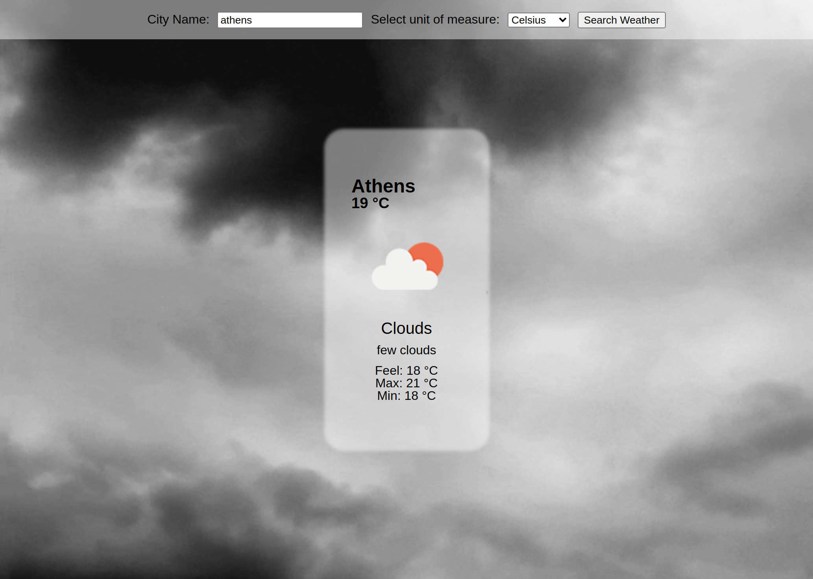

# Weather App

A simple but goodlooking weather app, that is able to:
- Take you ubication and display your weather
- Take a city name and display the weather of that city
- If the city doest exist, throws a notice to the user
- Change images and background in based on the weather

## [Live Link](https://helman101.github.io/Todo-list/)

## Built With

- JavaScript
- HTML
- CSS

## Getting Started

To set up a local copy of the project

- `git clone git@github.com:helman101/weather-app.git`
- `cd weather-app`
- `npm install`

## Get Api Key

- Go to [openweathermap](https://openweathermap.org/price)
- Select free Api key
- Create an account if you dont have one
- Copy your new Api Key
- Go to src/weather.js
- Paste your new Api Key were says 'API_KEY_HERE'

## Run locally

- Now you are ready to run a local server
- Go to your command line and put `npm run start`
- Go to http://localhost:8080/
- Try it!!

## Author

👤 **Andres Ortegon**

- GitHub: [@helman101](https://github.com/helman101)
- Twitter: [@helman1011](https://twitter.com/Helman1011)
- LinkedIn: [Andres Ortegon](https://www.linkedin.com/in/helman101/)

## 🤝 Contributing

Contributions, issues, and feature requests are welcome!

## Show your support

Give a ⭐️ if you like this project!

## Acknowledgments

- To Microverse for their `README` template.

## 📝 [License](LICENSE)
